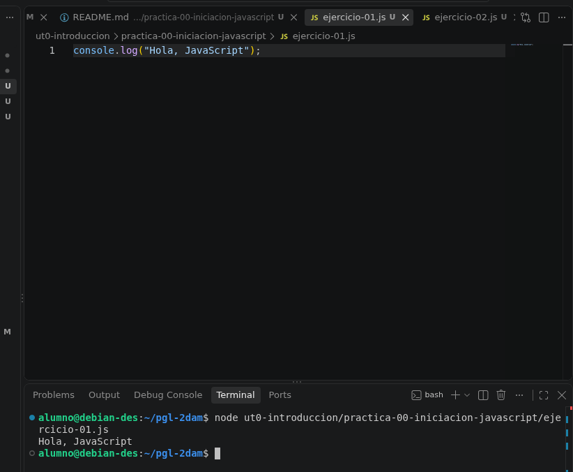
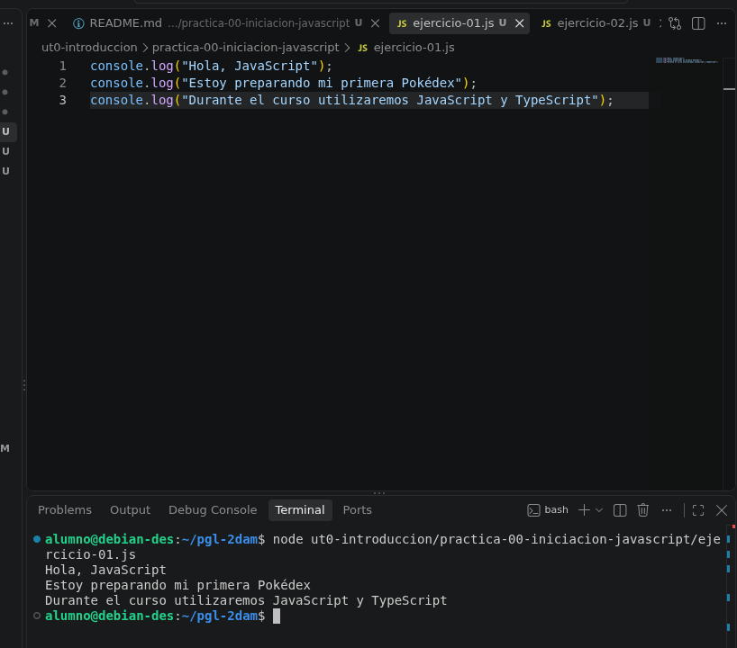
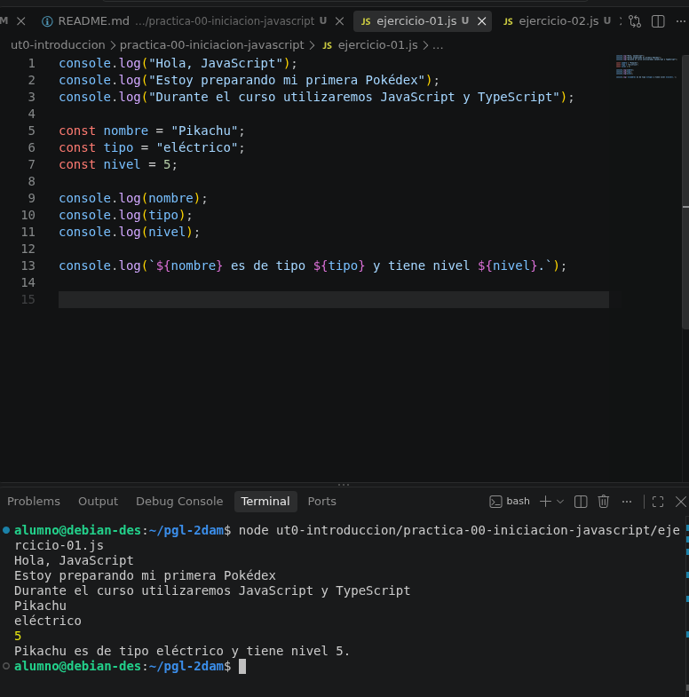
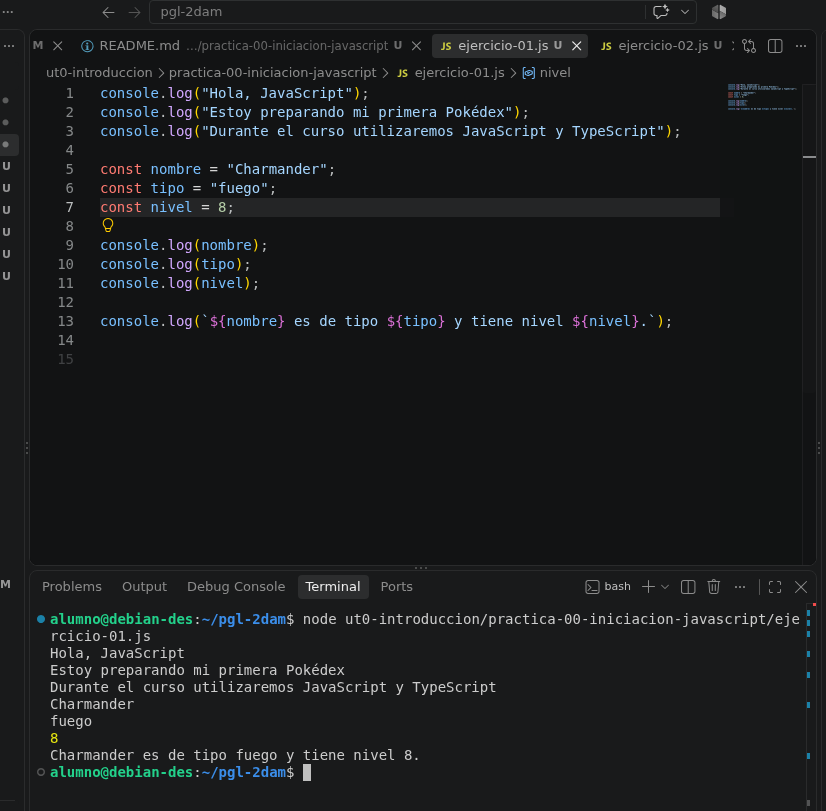
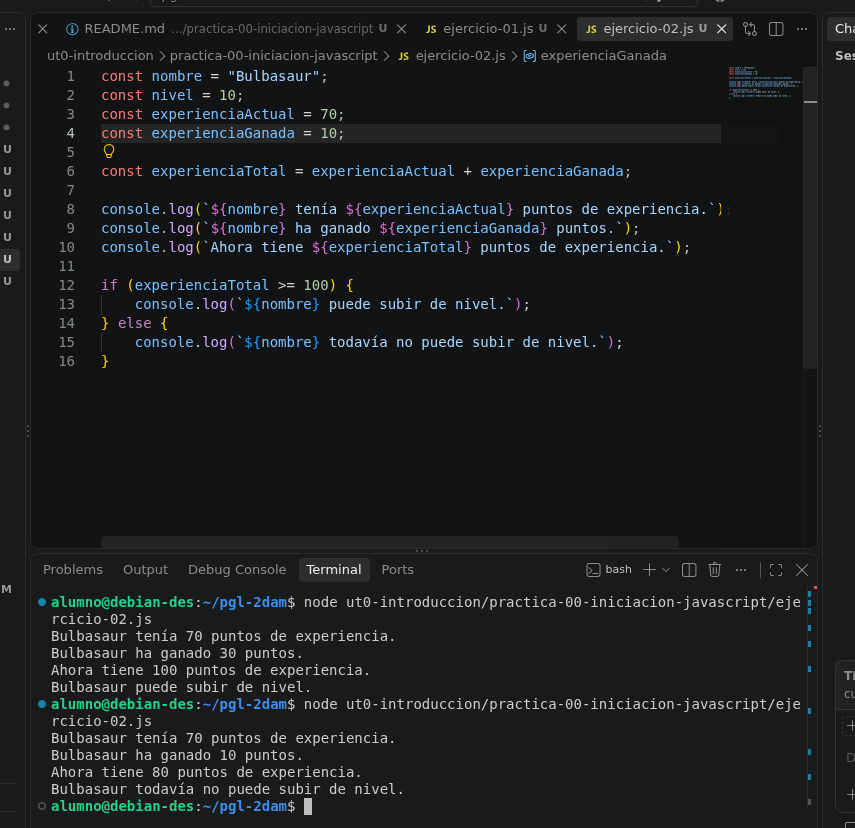

# Práctica 00. Iniciación a JavaScript

## Objetivos

En esta práctica he preparado el repositorio del módulo y he tenido una primera toma de contacto con JavaScript.

## Ejercicio 1. Mi primer programa

En este ejercicio he creado mi primer script en JavaScript. 
He aprendido a mostrar mensajes de texto en la consola y a declarar variables para almacenar datos de diferentes tipos.
Por último, he combinado estas variables en un único mensaje en pantalla utilizando plantillas de texto.

## Ejercicio 2. Operaciones básicas

En este ejercicio se calcula la experiencia total sumando los puntos actuales y los ganados. 
Además, utiliza if y else mediante >=  para evaluar si la experiencia total alcanza los 100 puntos y decidir si el Pokémon puede subir de nivel o no.

## Conceptos utilizados

- `console.log()`: Es una función que se utiliza para imprimir información en la consola.
- Variable: Es un espacio reservado en memoria que permite almacenar un dato específico
- Texto: Es un tipo de dato
- Número: Es un tipo de dato numérico
- Condición: Es una estructura de control

## Dificultades encontradas

El único problema que he encontrado ha sido no tener instalado node en el sistema.

## Conclusión

He aprendido lo básico de JavaScript debido a que anteriormente no habia visto este lenguaje.